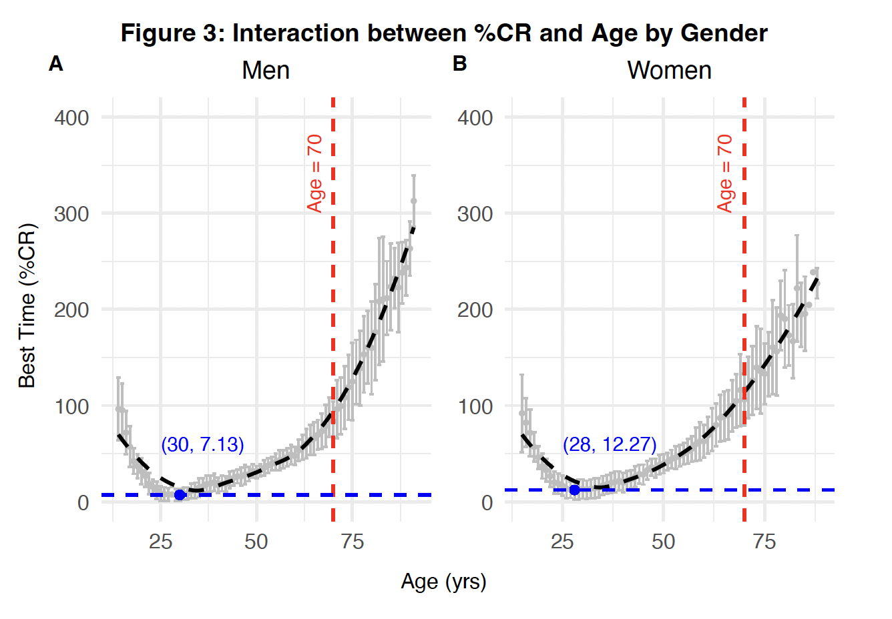

# PHP2550-Project1-EDA

### Background

The implications of weather conditions on athletics performance in endurance exercises such as marathons have raised considerable attention over the past few years. It was hypothesized by researchers that participants’ performance would be degraded as they aged, or with warmer conditions, or by sex. Among all weather-related factors, temperature (i.e., heat or cold), relative humidity (i.e., dry or humid), wind speed, solar radiation, and air quality are considered to have the largest potential effect. Exploration needed to be done to validate these statements and to determine the relationship between weather conditions and the performance.

### Methods

This report explores the relationship between age and marathon performance in men and women. Exploring the impact of environmental conditions including temperature, humidity, solar radiation, and wind on marathon performance, and whether the impact differs across age and gender. Identifying the weather conditions that have the largest impact on marathon performance.

### Results

This report's exploratory data analysis revealed that there was a U-shape, non-linear relationship between marathon performance and age for both men and women. This suggests that the performance would first increase, reach a peak, and then decrease after some point of age. On average, the optimal performance was observed in women age 28, and men age 30. Weather conditions tended to have a larger impact on the elderly compared to the younger, relationships differ by different weather-related variables. The full report can be found [here](PHP2550_Project1.pdf).

## Files
### R
`preprocessing.R`: Contains the preprocessing steps necessary for exploratory data analysis. Specifically, this script merged the air quality variable to the raw data and created a categorical variable for age `age_grp` using the 24, 39, 54, and 69 cut-offs. 

### report
`EDA_report.Rmd`: The Rmarkdown version of the Exploratory Data Analysis report, which includes both written text interpretations and raw code used in the analysis. 

`EDA_report.pdf`: The PDF version of the Exploratory Data Analysis report, which includes both written text interpretations and a Code Appendix with the raw code used in the analysis. 

## Dependencies

The following packages were used in this analysis: 

 - Data Manipulation: `dplyr`, `tidyr`
 - Table Formatting: `gt`, `gtsummary`, `knitr`, `kableExtra`
 - Data Visualization: `ggplot2`, `ggpubr`, `ggExtra`, `ggcorrplot`
 - Time Conversion: `lubridate`
 - Model: `lmerTest`, `broom.mixed`
 
